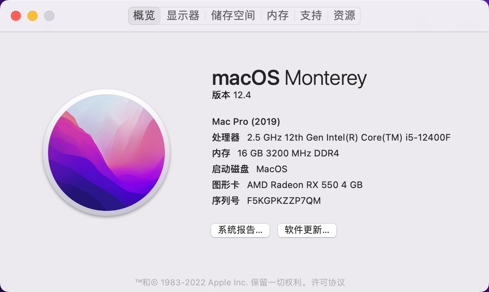

本机配置：

主板：装机猿币六六零一号

CPU：i5-12400

显卡： 蓝宝石 RX550 4g 白金版

内存：英睿达铂胜  DDR4 3200  8x2

硬盘： 三星980 500g

有线网卡：Realtek 2.5G 有线网卡 

============================

OC版本： 0.8.1

支持10.15.x及11.6.x及12.x，13的beta

可以驱动的部分：

☆ CPU 睿频正常

☆ USB3.0和2.0识别

☆ 2.5G有线网卡识别正常

☆ 音量调节正常

☆ 睡眠唤醒正常

无法驱动的部分：

☆ 核显

已注入intel无线网卡及蓝牙驱动，由于没有安装无线网卡模块，无法测试Wi-Fi、蓝牙、随航、隔空投送等功能。

问题：

睡眠唤醒后无法进入设置的 鼠标，键盘快捷键，尚未解决。

自用EFI，参考https://github.com/Xmingbai/ASUS-TUF-GAMING-B660M-PLUS-Wi-Fi-D4-Hackintosh.git